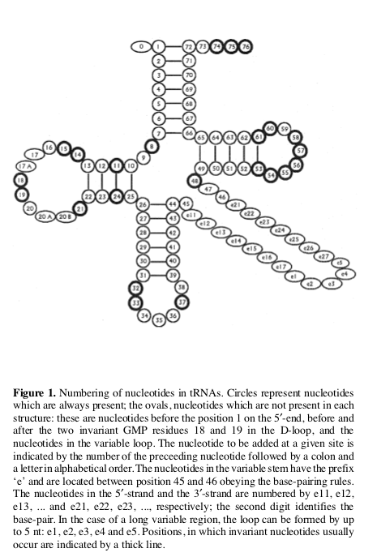
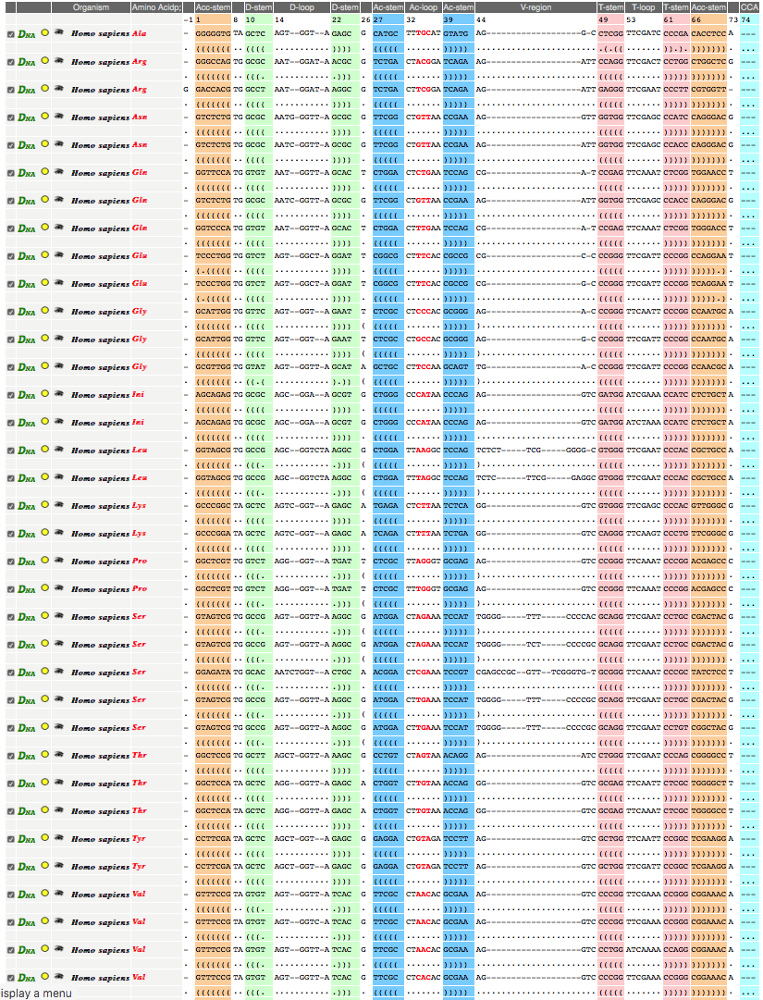
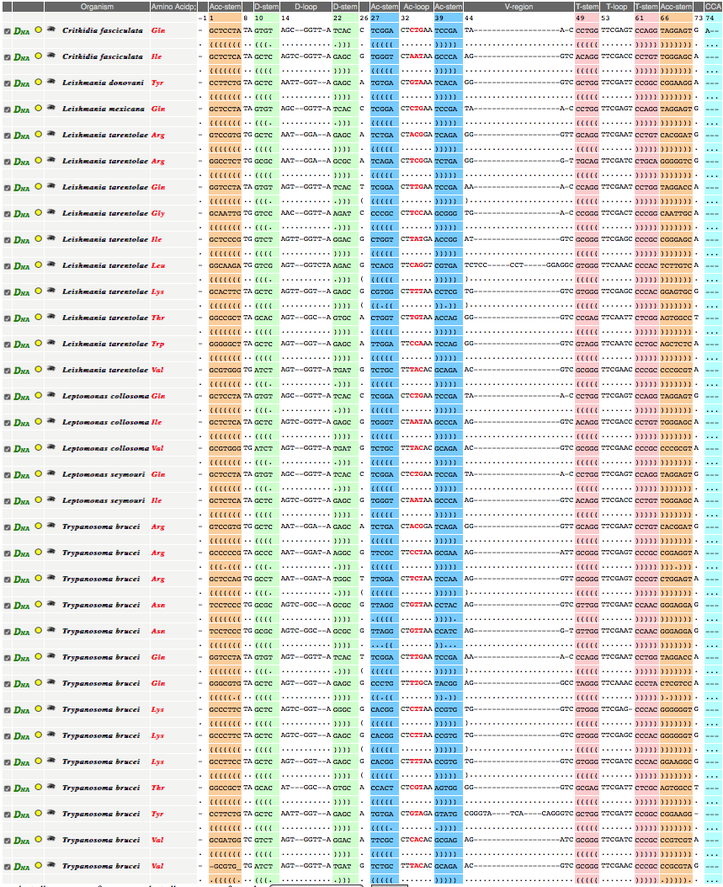

```{r setup, include=FALSE}
knitr::opts_chunk$set(echo = TRUE)
```

# About this Document and General Orientation

This is the CIF Analysis Workflow for Kelly et al. (2019) using the old software for this (logofun and logotax by Eva Freyhult). In this version, I edited the COVEA alignment at sites 45 and 47, where COVEA introduced gaps in type II (long variable arm) tRNAs. I create two site-selection variations from the edited master alignment, one with 72 sites (excluding 17,17a and 20a, to be analyzed excluding the gap state), and another with 74 sites (including 17 and 20a, excluding 17a) to be analyzed including the gap state. The master alignment with sites and species is in the file `combined.covea.v5.editedVarm.mase` which can be opened by the program SEAVIEW. It documents the site-selection and the grouping of sequences that were edited in thei9r variable arms at sites 45 and 47. 

The fasta file `combined.covea.v5.editedVarm.fas` contains this file edited to remove sequences labeled "-OLD" as described below. The fasta file `combined.covea.v5.editedVarm.sites72.fas` contains the site-selected alignment with 72 sites and the file`combined.covea.v5.editedVarm.sites74.fas` contains the site-selected alignment with 74 sites. These are edited below to remove sequences labeled "-OLD".

# Initial Data and Sequence Filtering

Fasta data of Finalized TryTrypDB+Human Gene Data was received from Fateme. There were 3923 total sequences, of which 433 were human and 3490 were from TryTrypDB. Two of the human genes turned out to be selenocysteine (SEC) and were excluded.

```{r, eval=FALSE}
# Show SeC exclusion
# Show and document Species Exclusions
```

The final number of sequences was ...  numbers of sequences per function per species was ... table. 

Calculate statistics table for Manuscript.

# Round 1 Alignment Against Old Preliminary Data Results

I decided to co-align the new and preliminary data, so I could remap earlier work on site-selection and coordinate mapping to the new data. I use Perl one-liners to modify the IDs of data to make it easy to filter out the co-aligned preliminary data later and separate the aligned new data into functional classes. For preliminary data I used the file HomoC_Cruzi_red.fas, which had already been site-selected. I had to change two identifiers corresponding to BRENER_52 and BRENER_78 so the labeling and filtering strategy would work.

```{bash, eval=FALSE}
faswc final_geneset_Homo_TryTryp.fasta
fasgrep Homo final_geneset_Homo_TryTryp.fasta | faswc
fasgrep -v Homo final_geneset_Homo_TryTryp.fasta | faswc
fastr --degap HomoC_Cruzi_red.fas | fassub -i '$' '-old' > CruziHomoOld.fas
faswc CruziHomoOld.fas  # 1356 old sequences
cat CruziHomoOld.fas final_geneset_Homo_TryTryp.fasta | fasgrep -i -- "-old" | faswc # 1356 
cat CruziHomoOld.fas final_geneset_Homo_TryTryp.fasta > combined.fas
covea -o combined.covea ~/lib/tRNAscan-SE/TRNA2-euk.cm combined.fas
sreformat -u a2m combined.covea | tr '[a-z].' '[A-Z]-' | fasgrep -i -- "-OLD" | faswc # 1356
sreformat -u a2m combined.covea | tr '[a-z].' '[A-Z]-' > combined.covea.fas
```

# Mapping to Sprinzl Coordinates and Selecting Sites



tRNAdb alignments show that D-arm extra bases are aligned rightwards, and that type II tRNAs with long variable arms (Ser, Leu, Tyr) are compositionally atypical at positions 45 and 47 at the beginning and end of the variable arm. 





The covea alignment aligned Darms as in tRNAdb, and no editing was required. 

In the Variable arm, Type II tRNAs required manual editing to remove gaps at positions 45 and 47 probably owing to poor compositional fit to those sites in the underlying covariance model.


This mapping to coordinates is represented in `tRNA_L_skel_Leish.sites72.txt` and `tRNA_L_skel_Leish.sites74.txt`. "NA" in the first column means the row is not mapped to Sprinzl Coordinates. "NA"" in both means that a non-structural vertex is drawn in the backbone of the figure for that coordinate.

# Removing Preliminary Data Sequences and Preparing Input Alignments

```{bash, eval=FALSE}
fasgrep -i -- "-OLD" combined.covea.v5.editedVarm.sites72.fas | faswc # 1356
fasgrep -i -- "-OLD" combined.covea.v5.editedVarm.sites74.fas | faswc # 1356
fasgrep -vi -- "-OLD" combined.covea.v5.editedVarm.sites72.fas   >  covea.sites72.v5.fas
fasgrep -vi -- "-OLD" combined.covea.v5.editedVarm.sites74.fas   >  covea.sites74.v5.fas
faswc covea.sites72.v5.fas # 3923 sequences
faswc covea.sites74.v5.fas # 3923 sequences
mkdir MAJOR.v5
mkdir INFANTUM.v5
mkdir MEXICANA.v5
mkdir VIANNIA.v5
mkdir ENRIETTII.v5
mkdir LEPTOCRITH.v5
mkdir AMTRYP.v5
mkdir AFTRYP.v5
mkdir HOMO.v5
fasgrep -i "LMAJOR|LTROPICA|LAETHIOPICAL147|LGERBILLILEM452|LTURANICALEM423|LARABICALEM1108" covea.sites72.v5.fas > MAJOR.v5/MAJOR.covea.sites72.v5.fas
fasgrep -i "LMAJOR|LTROPICA|LAETHIOPICAL147|LGERBILLILEM452|LTURANICALEM423|LARABICALEM1108" covea.sites74.v5.fas > MAJOR.v5/MAJOR.covea.sites74.v5.fas
fasgrep -i "LINFANTUMJPCM5|LDONOVANI" covea.sites72.v5.fas > INFANTUM.v5/INFANTUM.covea.sites72.v5.fas
fasgrep -i "LINFANTUMJPCM5|LDONOVANI" covea.sites74.v5.fas > INFANTUM.v5/INFANTUM.covea.sites74.v5.fas
fasgrep -i "LMEXICANA|LAMAZONENSIS" covea.sites72.v5.fas    > MEXICANA.v5/MEXICANA.covea.sites72.v5.fas
fasgrep -i "LMEXICANA|LAMAZONENSIS" covea.sites74.v5.fas    > MEXICANA.v5/MEXICANA.covea.sites74.v5.fas
fasgrep -i "LPANAMENSIS|LBRAZILIENSIS" covea.sites72.v5.fas > VIANNIA.v5/VIANNIA.covea.sites72.v5.fas
fasgrep -i "LPANAMENSIS|LBRAZILIENSIS" covea.sites74.v5.fas > VIANNIA.v5/VIANNIA.covea.sites74.v5.fas
fasgrep -i "LENRIETTII|LSPMARLEM" covea.sites72.v5.fas      > ENRIETTII.v5/ENRIETTII.covea.sites72.v5.fas
fasgrep -i "LENRIETTII|LSPMARLEM" covea.sites74.v5.fas      > ENRIETTII.v5/ENRIETTII.covea.sites74.v5.fas
fasgrep -i "LSEYMOURIA|LPYRRHOCORI|CFASCICULATACFCL" covea.sites72.v5.fas     > LEPTOCRITH.v5/LEPTOCRITH.covea.sites72.v5.fas
fasgrep -i "LSEYMOURIA|LPYRRHOCORI|CFASCICULATACFCL" covea.sites74.v5.fas     > LEPTOCRITH.v5/LEPTOCRITH.covea.sites74.v5.fas
fasgrep -i "TGRAYIANR4|TCRUZI" covea.sites72.v5.fas | fasgrep -vi "TCRUZICLBRENER[^EN]" > AMTRYP.v5/AMTRYP.covea.sites72.v5.fas
fasgrep -i "TGRAYIANR4|TCRUZI" covea.sites74.v5.fas | fasgrep -vi "TCRUZICLBRENER[^EN]" > AMTRYP.v5/AMTRYP.covea.sites74.v5.fas
fasgrep -i "TBRUCEI|TCONGOLENSE|TEVANSI" covea.sites72.v5.fas > AFTRYP.v5/AFTRYP.covea.sites72.v5.fas
fasgrep -i "TBRUCEI|TCONGOLENSE|TEVANSI" covea.sites74.v5.fas > AFTRYP.v5/AFTRYP.covea.sites74.v5.fas
fasgrep -i "HOMO" covea.sites72.v5.fas > HOMO.v5/HOMO.covea.sites72.v5.fas
fasgrep -i "HOMO" covea.sites74.v5.fas > HOMO.v5/HOMO.covea.sites74.v5.fas
fasgrep -i ALA HOMO.v5/HOMO.covea.sites72.v5.fas > HOMO.v5/HOMO.sites72.v5_A.fas
fasgrep -i ALA HOMO.v5/HOMO.covea.sites74.v5.fas > HOMO.v5/HOMO.sites74.v5_A.fas
fasgrep -i CYS HOMO.v5/HOMO.covea.sites72.v5.fas > HOMO.v5/HOMO.sites72.v5_C.fas
fasgrep -i CYS HOMO.v5/HOMO.covea.sites74.v5.fas > HOMO.v5/HOMO.sites74.v5_C.fas
fasgrep -i ASP HOMO.v5/HOMO.covea.sites72.v5.fas > HOMO.v5/HOMO.sites72.v5_D.fas
fasgrep -i ASP HOMO.v5/HOMO.covea.sites74.v5.fas > HOMO.v5/HOMO.sites74.v5_D.fas
fasgrep -i GLU HOMO.v5/HOMO.covea.sites72.v5.fas > HOMO.v5/HOMO.sites72.v5_E.fas
fasgrep -i GLU HOMO.v5/HOMO.covea.sites74.v5.fas > HOMO.v5/HOMO.sites74.v5_E.fas
fasgrep -i PHE HOMO.v5/HOMO.covea.sites72.v5.fas > HOMO.v5/HOMO.sites72.v5_F.fas
fasgrep -i PHE HOMO.v5/HOMO.covea.sites74.v5.fas > HOMO.v5/HOMO.sites74.v5_F.fas
fasgrep -i GLY HOMO.v5/HOMO.covea.sites72.v5.fas > HOMO.v5/HOMO.sites72.v5_G.fas
fasgrep -i GLY HOMO.v5/HOMO.covea.sites74.v5.fas > HOMO.v5/HOMO.sites74.v5_G.fas
fasgrep -i HIS HOMO.v5/HOMO.covea.sites72.v5.fas > HOMO.v5/HOMO.sites72.v5_H.fas
fasgrep -i HIS HOMO.v5/HOMO.covea.sites74.v5.fas > HOMO.v5/HOMO.sites74.v5_H.fas
fasgrep -i ILE HOMO.v5/HOMO.covea.sites72.v5.fas > HOMO.v5/HOMO.sites72.v5_I.fas
fasgrep -i ILE HOMO.v5/HOMO.covea.sites74.v5.fas > HOMO.v5/HOMO.sites74.v5_I.fas
fasgrep -i LYS HOMO.v5/HOMO.covea.sites72.v5.fas > HOMO.v5/HOMO.sites72.v5_K.fas
fasgrep -i LYS HOMO.v5/HOMO.covea.sites74.v5.fas > HOMO.v5/HOMO.sites74.v5_K.fas
fasgrep -i LEU HOMO.v5/HOMO.covea.sites72.v5.fas > HOMO.v5/HOMO.sites72.v5_L.fas
fasgrep -i LEU HOMO.v5/HOMO.covea.sites74.v5.fas > HOMO.v5/HOMO.sites74.v5_L.fas
fasgrep -i "\WMET" HOMO.v5/HOMO.covea.sites72.v5.fas > HOMO.v5/HOMO.sites72.v5_M.fas
fasgrep -i "\WMET" HOMO.v5/HOMO.covea.sites74.v5.fas > HOMO.v5/HOMO.sites74.v5_M.fas
fasgrep -i ASN HOMO.v5/HOMO.covea.sites72.v5.fas > HOMO.v5/HOMO.sites72.v5_N.fas
fasgrep -i ASN HOMO.v5/HOMO.covea.sites74.v5.fas > HOMO.v5/HOMO.sites74.v5_N.fas
fasgrep -i PRO HOMO.v5/HOMO.covea.sites72.v5.fas > HOMO.v5/HOMO.sites72.v5_P.fas
fasgrep -i PRO HOMO.v5/HOMO.covea.sites74.v5.fas > HOMO.v5/HOMO.sites74.v5_P.fas
fasgrep -i GLN HOMO.v5/HOMO.covea.sites72.v5.fas > HOMO.v5/HOMO.sites72.v5_Q.fas
fasgrep -i GLN HOMO.v5/HOMO.covea.sites74.v5.fas > HOMO.v5/HOMO.sites74.v5_Q.fas
fasgrep -i ARG HOMO.v5/HOMO.covea.sites72.v5.fas > HOMO.v5/HOMO.sites72.v5_R.fas
fasgrep -i ARG HOMO.v5/HOMO.covea.sites74.v5.fas > HOMO.v5/HOMO.sites74.v5_R.fas
fasgrep -i SER HOMO.v5/HOMO.covea.sites72.v5.fas > HOMO.v5/HOMO.sites72.v5_S.fas
fasgrep -i SER HOMO.v5/HOMO.covea.sites74.v5.fas > HOMO.v5/HOMO.sites74.v5_S.fas
fasgrep -i THR HOMO.v5/HOMO.covea.sites72.v5.fas > HOMO.v5/HOMO.sites72.v5_T.fas
fasgrep -i THR HOMO.v5/HOMO.covea.sites74.v5.fas > HOMO.v5/HOMO.sites74.v5_T.fas
fasgrep -i VAL HOMO.v5/HOMO.covea.sites72.v5.fas > HOMO.v5/HOMO.sites72.v5_V.fas
fasgrep -i VAL HOMO.v5/HOMO.covea.sites74.v5.fas > HOMO.v5/HOMO.sites74.v5_V.fas
fasgrep -i TRP HOMO.v5/HOMO.covea.sites72.v5.fas > HOMO.v5/HOMO.sites72.v5_W.fas
fasgrep -i TRP HOMO.v5/HOMO.covea.sites74.v5.fas > HOMO.v5/HOMO.sites74.v5_W.fas
fasgrep -i IMET HOMO.v5/HOMO.covea.sites72.v5.fas > HOMO.v5/HOMO.sites72.v5_X.fas
fasgrep -i IMET HOMO.v5/HOMO.covea.sites74.v5.fas > HOMO.v5/HOMO.sites74.v5_X.fas
fasgrep -i TYR HOMO.v5/HOMO.covea.sites72.v5.fas > HOMO.v5/HOMO.sites72.v5_Y.fas
fasgrep -i TYR HOMO.v5/HOMO.covea.sites74.v5.fas > HOMO.v5/HOMO.sites74.v5_Y.fas
fasconvert -fo clustalw HOMO.v5/HOMO*_*.fas
perl -e 'foreach my $clade (qw/MAJOR INFANTUM MEXICANA VIANNIA ENRIETTII LEPTOCRITH AMTRYP AFTRYP/){foreach my $f (split //,"ACDEFGHIKLMNPQRSTVWXY"){system "fasgrep -i \"_$f\$\" $clade.v5/$clade.covea.sites72.v5.fas | fasconvert -o clustalw > $clade.v5/${clade}.sites72.v5_$f.aln\n"}}'
perl -e 'foreach my $clade (qw/MAJOR INFANTUM MEXICANA VIANNIA ENRIETTII LEPTOCRITH AMTRYP AFTRYP/){foreach my $f (split //,"ACDEFGHIKLMNPQRSTVWXY"){system "fasgrep -i \"_$f\$\" $clade.v5/$clade.covea.sites74.v5.fas | fasconvert -o clustalw > $clade.v5/${clade}.sites74.v5_$f.aln\n"}}'
```
# Function Logos


```{bash, eval=FALSE}
perl -e 'foreach my $clade (qw/HOMO MAJOR INFANTUM MEXICANA VIANNIA ENRIETTII LEPTOCRITH AMTRYP AFTRYP/){system "logofun --states ACGT  -f 1 -b 1 -o $clade.v5/${clade}.sites72.v5 $clade.v5/${clade}.sites72.v5_*.aln; logofun --states ACGT- -f 1 -b 1 -o $clade.v5/${clade}.sites74.v5 $clade.v5/${clade}.sites74.v5_*.aln"}'
```

# ID Logos

```{bash, eval=FALSE}
perl -e 'foreach my $clade (qw/MAJOR INFANTUM MEXICANA VIANNIA ENRIETTII LEPTOCRITH AMTRYP AFTRYP/){system "logotax -b 3 -l infodiff -p other --states ACGT -o $clade.v5/HOMO_${clade}_ID.sites72.v5 \"HOMO.v5/HOMO.sites72.v5_*.aln\" \"$clade.v5/${clade}.sites72.v5_*.aln\";logotax -b 3 -l infodiff -p other --states ACGT -o $clade.v5/HOMO_${clade}_ID.sites74.v5 \"HOMO.v5/HOMO.sites74.v5_*.aln\" \"$clade.v5/${clade}.sites74.v5_*.aln\"";}'
```

# KLD Logos

```{bash, eval=FALSE}
perl -e 'foreach my $clade (qw/MAJOR INFANTUM MEXICANA VIANNIA ENRIETTII LEPTOCRITH AMTRYP AFTRYP/){system "logotax -b 3 -l KLdiff2 -p other --states ACGT -o $clade.v5/HOMO_${clade}_KLD.sites72.v5 \"HOMO.v5/HOMO.sites72.v5_*.aln\" \"$clade.v5/${clade}.sites72.v5_*.aln\";logotax -b 3 -l KLdiff2 -p other --states ACGT -o $clade.v5/HOMO_${clade}_KLD.sites74.v5 \"HOMO.v5/HOMO.sites74.v5_*.aln\" \"$clade.v5/${clade}.sites74.v5_*.aln\"";}'
```

# Fix the numbering and Convert to Tables

Currently, this does not include analysis of the gap state. There is some logic in logotax that must be debugged to handle the gap state.

```{bash, eval=FALSE}
perl -e 'foreach my $clade (qw/MAJOR INFANTUM MEXICANA VIANNIA ENRIETTII LEPTOCRITH AMTRYP AFTRYP/){system "perl generate_tables_from_logos_for_bubbleplots.pl -l tRNA_L_skel_Leish.sites72.txt $clade.v5/$clade.sites72.v5 $clade.v5/HOMO_${clade}_ID.sites72.v5_${clade}.sites72.v5 $clade.v5/HOMO_${clade}_ID.sites72.v5_HOMO.sites72.v5 $clade.v5/HOMO_${clade}_KLD.sites72.v5_${clade}.sites72.v5 > $clade.v5/$clade.sites72.v5_table.txt; perl generate_tables_from_logos_for_bubbleplots.pl -l tRNA_L_skel_Leish.sites74.txt $clade.v5/$clade.sites74.v5 $clade.v5/HOMO_${clade}_ID.sites74.v5_${clade}.sites74.v5 $clade.v5/HOMO_${clade}_ID.sites74.v5_HOMO.sites74.v5 $clade.v5/HOMO_${clade}_KLD.sites74.v5_${clade}.sites74.v5 > $clade.v5/$clade.sites74.v5_table.txt";}'
```

# Bubbleplots

```{r bubble}
MAJOR.72       <- read.table("MAJOR.v5/MAJOR.sites72.v5_table.txt",header=T);
INFANTUM.72    <- read.table("INFANTUM.v5/INFANTUM.sites72.v5_table.txt",header=T);
MEXICANA.72    <- read.table("MEXICANA.v5/MEXICANA.sites72.v5_table.txt",header=T);
VIANNIA.72     <- read.table("VIANNIA.v5/VIANNIA.sites72.v5_table.txt",header=T);
ENRIETTII.72   <- read.table("ENRIETTII.v5/ENRIETTII.sites72.v5_table.txt",header=T);
LEPTOCRITH.72  <- read.table("LEPTOCRITH.v5/LEPTOCRITH.sites72.v5_table.txt",header=T);
AFTRYP.72      <- read.table("AFTRYP.v5/AFTRYP.sites72.v5_table.txt",header=T);
AMTRYP.72      <- read.table("AMTRYP.v5/AMTRYP.sites72.v5_table.txt",header=T);

MAJOR.74       <- read.table("MAJOR.v5/MAJOR.sites74.v5_table.txt",header=T);
INFANTUM.74    <- read.table("INFANTUM.v5/INFANTUM.sites74.v5_table.txt",header=T);
MEXICANA.74    <- read.table("MEXICANA.v5/MEXICANA.sites74.v5_table.txt",header=T);
VIANNIA.74     <- read.table("VIANNIA.v5/VIANNIA.sites74.v5_table.txt",header=T);
ENRIETTII.74   <- read.table("ENRIETTII.v5/ENRIETTII.sites74.v5_table.txt",header=T);
LEPTOCRITH.74  <- read.table("LEPTOCRITH.v5/LEPTOCRITH.sites74.v5_table.txt",header=T);
AFTRYP.74      <- read.table("AFTRYP.v5/AFTRYP.sites74.v5_table.txt",header=T);
AMTRYP.74      <- read.table("AMTRYP.v5/AMTRYP.sites74.v5_table.txt",header=T);

library("heR.Misc"); ## THIS IS REQUIRED FOR THE BUBBLEPLOT FUNCTION AND MUST BE DOWNLOADED FROM
## http://exposurescience.org/her.html


# THESE ARE THE COORDINATES FOR THE TRNA STRUCTURE BACKBONE IN THE FIGURES

line.x <- c(6.875,6.500,6.125,5.750,5.375,5.000,4.625,4.625,5.000,5.000,2.375
            ,2.750,2.375,2.750,2.500,2.875,3.250,2.875,2.500,2.125,1.750,1.375,1.000
            ,0.625,0.250,0.625,1.000,1.500,1.125,1.500,1.125,1.500,1.125,1.500,1.125
            ,1.500,1.125,0.625,1.000,1.375,1.750,2.125,2.500,2.875,2.375,2.750,2.375
            ,2.750,2.375,4.250,4.250,3.875,4.250,3.875,4.250,4.250,3.875,3.500,3.125
            ,2.750,2.250,1.875,1.500,1.125,1.500,1.875,2.250,2.750,3.125,3.500,3.875
            ,4.250,4.625,5.000,5.375,5.750,6.125,6.500,6.875,7.250,7.625,8.000,8.375);

line.y <- c(8.875,8.500,8.875,8.500,8.875,8.500,8.875,7.375,7.000
            ,3.500,3.500,3.875,4.250,4.625,5.125,5.500,5.875,6.250,6.625
            ,7.000,7.375,7.000,6.625,6.250,5.875,5.500,5.125,4.625,4.250
            ,3.875,3.500,3.125,2.750,2.375,2.000,1.625,1.250,0.750,0.375
            ,0.000,-0.375,0.000,0.375,0.750,1.250,1.625,2.000,2.375,2.750
            ,2.750,3.875,4.250,4.625,5.000,5.375,8.500,8.875,8.500,8.875
            ,8.500,8.000,8.375,8.750,9.125,9.500,9.875,10.250,9.750,10.125
            ,9.750,10.125,9.750,10.125,9.750,10.125,9.750,10.125,9.750,10.125
            ,9.750,10.125,9.750,10.125);


## THESE ARE FOR THE SPRINZL COORD LABELS
coord.labels <- c("1","5","10","14A","18","20C","25","30","35","40","45","50","55","60","65","70");
coord.labels.x <- c(6.875,5.375,2.375,2.875,1.750,0.625,1.125,1.500,1.750,2.750,3.875,3.875,1.875,2.250,4.250,6.125);
coord.labels.y <- c(8.875,8.875,3.500,5.500,7.375,5.500,3.500,1.625,-0.375,1.625,4.250,8.875,8.375,10.250,9.750,10.125);

xbump <- 0.35;
ybump <- 0.4;

up <- c(5,13,14,15,16,17);
up.coord.labels <- coord.labels[up];
up.coord.labels.x <- coord.labels.x[up];
up.coord.labels.y <- coord.labels.y[up] + ybump;

dn <- c(1,2,9,11,12);
dn.coord.labels <- coord.labels[dn];
dn.coord.labels.x <- coord.labels.x[dn];
dn.coord.labels.y <- coord.labels.y[dn] - ybump;

lt <- c(3,4,7);
lt.coord.labels <- coord.labels[lt];
lt.coord.labels.x <- coord.labels.x[lt] - xbump;
lt.coord.labels.y <- coord.labels.y[lt];

rt <- c(6,8,10);
rt.coord.labels <- coord.labels[rt];
rt.coord.labels.x <- coord.labels.x[rt] + xbump;
rt.coord.labels.y <- coord.labels.y[rt];


all.bubble <- function(df,name="bubble",alpha=0.5,fact=0.5,area=TRUE,legend=FALSE) { 
  gains <- (df$gainbits * df$gainfht);
  convs <- (df$convbits * df$convfht);
  map2rgb <- function (c) { rgb(t(col2rgb(c))/255,alpha=alpha);}
  colormap <- function (g,c) { 
     y <- rep(0,length(g));
     y[g <  0.48            & c < 0.44]             <- rgb(t(col2rgb("white"))/255,alpha=alpha);
     y[g >= 0.48 & g < 0.95 & c < 0.44]             <- rgb(t(col2rgb("darkred"))/255,alpha=alpha);
     y[g >= 0.95            & c < 0.44]             <- rgb(t(col2rgb("red"))/255,alpha=alpha);
     y[g <  0.48            & c >= 0.44 & c < 0.70] <- rgb(t(col2rgb("darkblue"))/255,alpha=alpha);
     y[g >= 0.48 & g < 0.95 & c >= 0.44 & c < 0.70] <- rgb(t(col2rgb("darkmagenta"))/255,alpha=alpha);
     y[g >= 0.95            & c >= 0.44 & c < 0.70] <- map2rgb("deeppink");
     y[g <  0.48            & c >= 0.70]            <- map2rgb("blue");
     y[g >= 0.48 & g < 0.95 & c >= 0.70]            <- map2rgb("blueviolet");
     y[g >= 0.95            & c >= 0.70]            <- map2rgb("magenta");
     y;
  }
  colors <- colormap(gains,convs);
  
  widthmap <- function (g,c) {
     y <- rep(1,length(g));
     y[g < 0.48 & c < 0.44] <- 1;
     y[g >= 0.48 | c >= 0.44] <- 2;
     y[g >= 0.95 | c >= 0.70] <- 3;	
     y;
  }
  widths <- widthmap(gains,convs);

  for (class in levels(df$aa)) {
    filenm <- paste(name,"_",class,".pdf",sep="");
    pdf(file=filenm,version="1.4");
    bubbleplot(
             df$x[df$aa == class],
             df$y[df$aa == class],
	     (df$fbits[df$aa == class] * df$fht[df$aa == class]),
	     fact=fact, #0.265165 = sqrt(2*0.375^2)/2
	     area=area, 
	     fg = rgb(t(col2rgb("black")/255)),
	     bg = colors[df$aa == class],
	     box=FALSE,
	     axes=FALSE,
	     lwd=2
	     );
    lines(line.x,line.y);
    text(labels=up.coord.labels,x=up.coord.labels.x,y=up.coord.labels.y);
    text(labels=dn.coord.labels,x=dn.coord.labels.x,y=dn.coord.labels.y);
    text(labels=lt.coord.labels,x=lt.coord.labels.x,y=lt.coord.labels.y);
    text(labels=rt.coord.labels,x=rt.coord.labels.x,y=rt.coord.labels.y);
    if (legend) {
      legend.x <- rep(df$x[df$aa == "X" &  df$state == "A" & 
                    (df$sprinzl == "68" |  df$sprinzl == "70" |
                     df$sprinzl == "72" )] + c(0.2,0.3,0.4),3);  
      legend.y <- c(rep(df$y[df$aa == "X" &  df$state == "A" & df$sprinzl == "31"],3),
      	       	    rep(df$y[df$aa == "X" &  df$state == "A" & df$sprinzl == "27"],3), 
                    rep(df$y[df$aa == "X" &  df$state == "A" & df$sprinzl == "23"],3));
      legend.z <- rep(2.2,9);
      legend.c <- colormap(c(0,0,0,0.5,0.5,0.5,1,1,1),c(0,0.5,1,0,0.5,1,0,0.5,1));
      bubbleplot(legend.x, legend.y, legend.z,fact=fact,area=area,bg=legend.c,
	     add=TRUE,
	     box=FALSE,axes=FALSE,lwd=2);

    } 
    prime.x <- df$x[df$aa == "X" &  df$state == "A" &
                (df$sprinzl == "1" |  df$sprinzl == "75")];
    prime.y <- df$y[df$aa == "X" &  df$state == "A" &
                (df$sprinzl == "1" |  df$sprinzl == "75")];
    text(labels=c("5'","3'"),x=prime.x,y=prime.y,adj=c(-0.9,0));	
    dev.off();
  }
}

all.bubble(MAJOR.72,name="MAJOR.v5/MAJOR.72");
all.bubble(INFANTUM.72,name="INFANTUM.v5/INFANTUM.72");
all.bubble(MEXICANA.72,name="MEXICANA.v5/MEXICANA.72");
all.bubble(VIANNIA.72,name="VIANNIA.v5/VIANNIA.72");
all.bubble(ENRIETTII.72,name="ENRIETTII.v5/ENRIETTII.72");
all.bubble(LEPTOCRITH.72,name="LEPTOCRITH.v5/LEPTOCRITH.72");
all.bubble(AMTRYP.72,name="AMTRYP.v5/AMTRYP.72");
all.bubble(AFTRYP.72,name="AFTRYP.v5/AFTRYP.72");
all.bubble(MAJOR.74,name="MAJOR.v5/MAJOR.74");
all.bubble(INFANTUM.74,name="INFANTUM.v5/INFANTUM.74");
all.bubble(MEXICANA.74,name="MEXICANA.v5/MEXICANA.74");
all.bubble(VIANNIA.74,name="VIANNIA.v5/VIANNIA.74");
all.bubble(ENRIETTII.74,name="ENRIETTII.v5/ENRIETTII.74");
all.bubble(LEPTOCRITH.74,name="LEPTOCRITH.v5/LEPTOCRITH.74");
all.bubble(AMTRYP.74,name="AMTRYP.v5/AMTRYP.74");
all.bubble(AFTRYP.74,name="AFTRYP.v5/AFTRYP.74")
```

